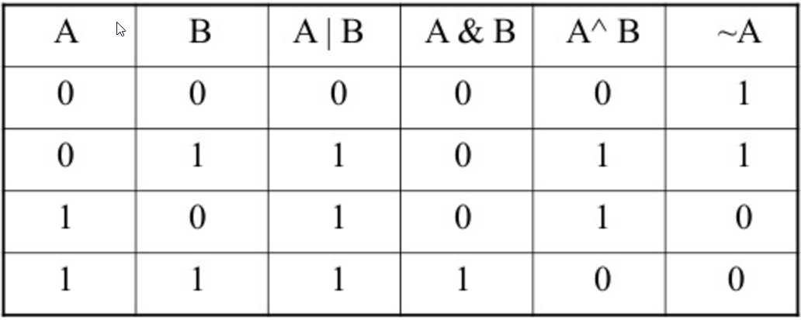

# 0x14. C - Bit manipulation

> Each file in this repository holds code that illustrates an essential concept of programming,
> specific to the C programming language:
> How to manipulate bits and use bitwise operators.

## Resource

- [Number Systems Introduction](https://www.youtube.com/watch?v=FFDMzbrEXaE&t=2s)
- [How to add and minus binary numbers](https://youtu.be/C5EkxfNEMjE)
- [Binary ..](https://youtu.be/RrJXLdv1i74)
- [Binary Addition and Subtraction With Negative Numbers](https://youtu.be/sJXTo3EZoxM)
- [Bitwise Operators in C part 1](https://youtu.be/jlQmeyce65Q)
- [Bitwise Operators in C part 2](https://youtu.be/8aFik6lPPaA)
- [Bitwise Operators in C part 3](https://youtu.be/GhhJP6vpEA8)
- [Bitwise Operators in C part 4](https://youtu.be/kYR5biY4OHw)
- [Algorithms: Bit Manipulation](https://youtu.be/NLKQEOgBAnw)
---
### Further notes on Bitwise Operators: `~`, `>>`, and `<<`

- This note provides a comprehensive understanding of three important bitwise operators: ~, >>, and <<.

- NOT Operator `~`

	- The NOT operator ~ yields 0 when the input bit is 1, and 1 when the input bit is 0.
- Right Shift ` >>`

	- The right shift operator `>>` is used in the form: `leftOperand` >> `rightOperand`.
		- `leftOperand` represents the value whose bits are subjected to right shifting, and `rightOperand` determines the number of positions by which the bits are shifted.
		- For instance, `0x02 >> 1` results in `0x01`.
	- When bits are shifted right, the vacant positions at the beginning are filled with zeros.
	- This operation is analogous to dividing `leftOperand` by 2 raised to the power of `rightOperand`. For example, `0x02 >> 1` is the same as `0x02` divided by 21.

- Left Shift `<<`

	- The left shift operator `<<` follows the pattern: `leftOperand` << `rightOperand`.
		- `leftOperand` denotes the value whose bits are subject to left shifting, and `rightOperand` dictates the number of positions for the shift.
		- As an illustration, `0x01 << 1` equals `0x02`.
	- Left shifting pads the vacated positions at the end with zeros.
	- This operation corresponds to multiplying `leftOperand` by 2 raised to the power of `rightOperand`. For instance, `0x01 << 1` is equivalent to `0x01` multiplied by 21.

- By grasping these bitwise operators and their functions, you can perform efficient bit manipulation and comprehend their role in various programming scenarios.

## Description of what each file shows:

* main.h ----------- holds files' function prototypes.
* main --- directory(folder) containing all main.c files.
* main.c files ----- holds test files that showcase examples of how to use functions

* Files that start with:
0. a function that converts a binary number to an unsigned int.
	- where `b` is pointing to a string of `0` and `1` chars.
	- Return: the converted number, or 0 if
	- there is one or more chars in the string `b` that is not `0` or `1`.
	- `b` is `NULL`.
1. a function that prints the binary representation of a number.
	- You are not allowed to use arrays.
	- You are not allowed to use `malloc`.
	- You are not allowed to use the `%` or `/` operators.
2.  a function that returns the value of a bit at a given index.
	- where `index` is the index, starting from `0` of the bit you want to get.
	- Returns: the value of the bit at index `index` or `-1` if an error occured.
3. a function that sets the value of a bit to 1 at a given index.
	- where index is the index, starting from 0 of the bit you want to set.
	- Returns: 1 if it worked, or -1 if an error occurred.
4.  a function that sets the value of a bit to 0 at a given index.
	- where index is the index, starting from 0 of the bit you want to set.
	- Returns: 1 if it worked, or -1 if an error occurred.
5. a function that returns the number of bits you would need to flip to get from one number to another.
	- You are not allowed to use the % or / operators.
6. a function that checks the endianness.
	- Returns: 0 if big endian, 1 if little endian.
	- Filename = `100-get_endianess.c`
7. [Crackme3](./101-password) : Find the password for this [program](https://github.com/holbertonschool/0x13.c/blob/master/crackme3).
	- First i had to clone the program's repo into the 0x14-bit_manipulation directory. `git clone https://github.com/alx-tools/0x13.c.git`
	- `cd` into the cloned repo. `cd 0x13.c/`
	- Move the crackme executable back into the 0x14 folder. `mv crackme3 ../`
	- Go back into the 0x14 folder. `cd ..`
	- Remove the cloned repository. `rm -rf 0x13.c/`
	- Then go ahead to use this command on the terminal. `curl https://raw.githubusercontent.com/osala-eng/alx_tools/master/crackme3.sh -o run.xt && chmod u+x run.xt && ./run.xt`.
	- After running successfully, it would have created the `101-password` file.
	- Run the executable with ./crackme3 'cat 101-password' as shown on the intranet task page.
	- Congratulations!🎉

### Environment
* Language: C
	* OS: Ubuntu 14.04 LTS
	* Compiler: gcc 4.8.4
	* Style guidelines: [Betty style](https://github.com/holbertonschool/Betty/wiki)

## Author

- Website - [Ayomide Kayode](https://github.com/AyomideKayode)
- ALX SOFTWARE ENGINEERING PROGRAM - [ALX_AFRICA](https://www.alxafrica.com/programmes/)
- Twitter - [@kazzy_wiz](https://www.twitter.com/kazzy_wiz)
