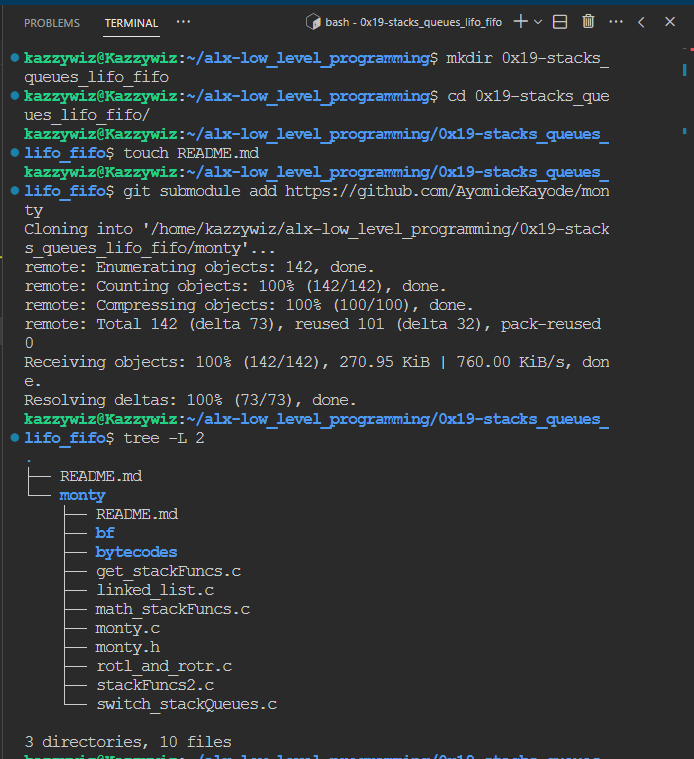

# 0x19 - C: Stacks and Queues, LIFO, FIFO

## Yo!
* I present to you, GIT SUBMODULES
* I just learnt something new.
* Thought about how I could reference the repository for this project(monty) inside this directory was a conundrum and I kept making research and I found.... `git submodule`

## How it works:
* Git submodules are like miniature Git repositories inside your main Git repository.

* Imagine you have a big project, let's call it "Project A," (in this case, my `alx-low_level_programming` repository) and you want to include another project, "Project B," (`monty repository`) inside it.
	- However, you don't want to copy all of Project B's files into Project A because Project B might be changing independently, and you want to keep track of those changes separately.

* Here's how Git submodules work:

	- **Adding a Submodule**: You add Project B as a submodule to Project A. This is like adding a reference or a link to Project B's repository within Project A.

	- **Cloning the Main Repository**: When someone else clones or checks out Project A from Git, they initially only get the main repository (Project A) without the contents of Project B.

	- **Initializing Submodules**: After cloning Project A, the person needs to run a command to initialize the submodule. This tells Git to fetch the specific version of Project B that Project A is using.

	- **Updating Submodules**: If Project B changes and you want those changes in Project A, you go into the submodule, fetch the latest changes, and update it. Then you commit those changes in the main repository (Project A) to record the new version of Project B.

	- **Keeping Submodules in Sync**: Other people who clone Project A also need to initialize and update the submodule to make sure they have the right version of Project B.

* So, in simple terms, think of a Git submodule as a way to include another Git project within your project😉, kind of like embedding a project inside another. This helps you manage dependencies and keep track of different parts of your codebase that might be maintained separately. It's like having a mini-Git repository within your main repository to handle a specific piece of functionality.

